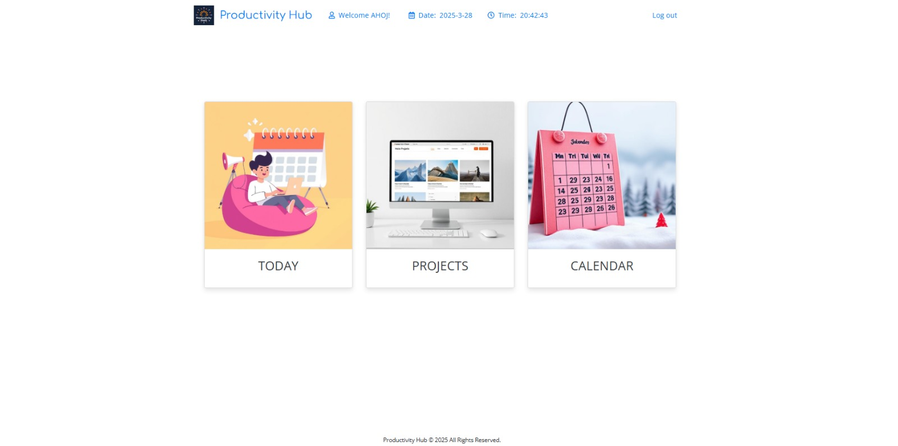

# 🗓️ TASK VAULT – Moderný študentský kalendár a systém správy úloh

Vitajte v mojom záverečnom študentskom projekte!
**TASK VAULT** je webová aplikácia, ktorá pomáha študentom efektívne plánovať úlohy, organizovať čas a mať prehľad o všetkých dôležitých termínoch na jednom mieste. Koniec s chaotickými poznámkami a zabudnutými termínmi!

---

## 🚀 Čo aplikácia dokáže?

- **Prehľadný kalendár** – mesačný, týždenný aj denný pohľad na úlohy a udalosti
- **Pridávanie, úprava a mazanie udalostí** – rýchlo a jednoducho cez moderné modálne okná
- **Projektový manažment** – správa projektov s možnosťou sledovania ich stavu
- **Kanban systém pre úlohy** – vizuálne sledovanie postupu v štýle To Do, In Progress, Done
- **Drag & Drop** – presúvanie udalostí priamo v kalendári
- **Denné úlohy** – správa každodenných povinností
- **Tmavý režim** – šetrite oči pri nočnom študovaní
- **Bezpečné prihlásenie a registrácia**
- **Responzívny dizajn** – použiteľné na počítači aj mobile

---

## 🛠️ Použité technológie


---

## 🖥️ Ukážka aplikácie

> 

---

## 📝 Inštalácia a spustenie

1. **Klonujte repozitár:**
   ```bash
   git clone https://github.com/tvoje-uzivatelske-meno/TASK-VAULT-uloharen.git
   ```
2. **Importujte databázu:**  
   Nájdite súbor `db/kanban.sql` a importujte ho do vašej MySQL databázy.
3. **Nakonfigurujte pripojenie k databáze:**  
   Otvorte `db/functions.php` a upravte prihlasovacie údaje pre vašu databázu:
   ```php
   private $hostname = 'localhost';
   private $username = 'root'; // Zmeňte podľa vašich údajov
   private $password = ''; // Zmeňte podľa vašich údajov
   private $database = 'kanban';
   ```
4. **Spustite lokálny server** (napr. XAMPP, WAMP).
5. **Otvorte aplikáciu v prehliadači** a prihláste sa alebo si vytvorte nový účet.

---

## 🐞 Riešenie problémov

- **Problém s prihlásením:** Skontrolujte, či ste správne importovali databázu a nastavili prístupové údaje.
- **Chyba pri vytváraní úlohy:** Uistite sa, že všetky zadané hodnoty spĺňajú požadované formáty.
- **Nezobrazia sa projekty:** Skontrolujte tabuľku 'projects' v databáze, či obsahuje správne dáta.
- **Problém s mazaním úloh:** Overte, či používateľ má príslušné oprávnenia k danej úlohe.

---

## 📁 Štruktúra projektu

- `css/` – Štýly a vzhľad aplikácie
- `js/` – JavaScript súbory pre interaktívne funkcie
- `db/` – Databázové skripty a pripojenie
- `events/` – Správa udalostí, akcií a modálnych okien
- `views/` – PHP šablóny pre jednotlivé stránky
- `parts/` – Opakovateľné komponenty (header, footer)
- `img/` – Obrázky a média
- `config/` – Konfiguračné súbory

---

## 👨‍💻 Autor

Projekt vytvoril: **Marek Sokol**  
Kontakt: marek.sokol@student.ukf.sk

---

## 🙏 Poďakovanie

Ďakujem všetkým, ktorí ma podporovali počas vývoja tohto projektu, a komunite open-source za skvelé knižnice a nástroje.

---

> **💡 Vtipná poznámka**: Tento projektový manažment systém bol vytvorený počas nespočetných bezsenných nocí, poháňaných kávou a motivovaný blížiacimi sa termínmi. Ak náhodou nájdete chybu, nebude to bug - iba neočakávaná funkcionalita vzniknutá o 3 ráno! 
> 
> *"TASK VAULT - pretože termíny prichádzajú rýchlejšie než výhovorky a prokrastinácia už nie je vaša najsilnejšia stránka. Jediný systém, kde deadliny nie sú len odporúčaním, ale skutočne sa dodržiavajú!"*

--- 